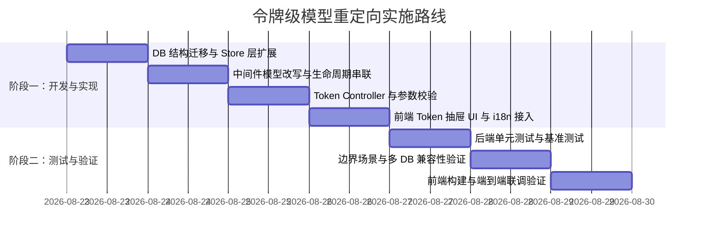

# PRD：令牌级模型重定向（Token-level Model Mapping）

> 版本：v1  
> 日期：2026-08-22  
> 关联 Issue：[#309](https://github.com/NookMux/NookMux/issues/309)  
> 状态：Draft / 待评审  

---

## 1. 概述

### 1.1 背景与痛点
在 AI API 网关日常使用中，许多特定客户端生态（如 Claude Code CLI、Cursor、Cline、OpenCode 等）存在**客户端强绑定/硬编码特定模型名**（例如 `claude-3-5-sonnet`、`claude-3-7-sonnet`、`claude-opus-4`）的现象。

当用户或团队没有 Anthropic 官方额度，但拥有高性价比替代模型（如智谱 GLM-4/5、DeepSeek-V3 等）并希望用平替模型驱动上述客户端时，目前仅能在**渠道层**配置模型重定向（`model_mapping`）。然而，渠道级重定向属于**出站适配**，导致了以下核心冲突：
1. **计费与预扣费失真**：网关在选渠道前按客户端请求模型（如 `claude-xxx`）查价和预扣费。若未配置 Claude 价格会直接报错拦截；若配置了，则扣除高昂的 Claude 额度，与廉价平替模型的实际成本严重不符。
2. **用量统计归因偏差**：日志主字段及 Dashboard 数据看板直接按请求模型（`claude-xxx`）聚合，无法在仪表盘中直观呈现 GLM 等上游模型的真实调用量。
3. **渠道开关方案的架构死锁**：若在渠道层加开关强制按映射后模型计费，会导致“预扣费时序早于渠道选取”、“重试导致计费模型突变”等架构冲突。

### 1.2 目标方案：令牌级模型重定向（方案 A）
将模型别名映射能力上移至**令牌（Token / API Key）**维度：
- 客户端请求进入网关完成 Token 鉴权后，**立即在入站阶段将请求模型改写为目标模型**。
- 后续的**模型权限检查、查价预扣费、渠道调度分发、实际上游请求、日志落库与 Dashboard 统计**全链路天然按重写后的模型执行。
- 渠道层无需再针对此类场景配置重复重定向，彻底解耦“客户端入站语义适配”与“供应商出站通道适配”。

---

## 2. 目标与非目标

### 2.1 目标
- **入站改写**：支持在 Token 上配置 JSON 格式的模型重定向映射表（`model_mapping`）。
- **全链路一致性**：经 Token 重定向后的请求，其计费倍率、预扣费、渠道负载均衡、日志记录、看板报表均以目标模型为基准。
- **循环与链式保护**：支持链式映射，同时严格防范自循环与环形引用死循环。
- **与现有能力正交共存**：
  - 与 Token 模型限制（`model_limits` / 白名单）协同运作（先改写，再基于改写后的模型或原始规则校验）。
  - 与渠道级模型重定向（出站映射）互不冲突、正交解耦。
- **多数据库与 i18n 兼容**：兼容 SQLite、MySQL >= 5.7.8、PostgreSQL >= 9.6，前后端全链路支持中/英/日多语言。

### 2.2 非目标
- 本 PRD 不修改日志表（`logs`）既有的基础索引结构，不增加额外冗余字段。
- 本 PRD 不废弃渠道层现有的 `model_mapping`（出站通道适配能力依然保留）。

---

## 3. 核心机制与架构设计

### 3.1 请求处理生命周期与时序

```
客户端请求 (例如 model: "claude-3-5-sonnet")
   │  携带专用 Token: sk-xxxx
   ▼
[1. Middleware: Token 鉴权 (auth.go)]
   │  从 DB/Cache 读取 Token 信息（含 token.model_mapping）
   ▼
[2. Middleware: 入站模型重定向改写]
   │  匹配映射规则: {"claude-3-5-sonnet": "glm-4-plus"}
   │  改写请求体 / Context 中的 model 为 "glm-4-plus"
   │  （可选：记录原始客户端请求模型至 Context 便于审计跟踪）
   ▼
[3. Middleware: 令牌模型白名单检查 (model_limits)]
   │  校验 Token 是否允许访问 "glm-4-plus"
   ▼
[4. Relay: Token 估算与定价查价 (ModelPriceHelper)]
   │  根据 "glm-4-plus" 查询模型倍率 / 上下文阶梯定价
   ▼
[5. Billing: 预扣费 (PreConsumeBilling)]
   │  按 "glm-4-plus" 的低倍率预扣额度
   ▼
[6. Distributor: 渠道调度 (distributor.go)]
   │  在所属分组中寻找支持 "glm-4-plus" 的可用渠道
   ▼
[7. Relay Adaptor / 上游转发]
   │  发往智谱 / 上游供应商，请求 model = "glm-4-plus"
   ▼
[8. Post-consume & 日志与报表]
   │  日志落库: log.model_name = "glm-4-plus"
   │  Dashboard 统计: GROUP BY model_name 自然归入 GLM
```

### 3.2 令牌级 vs 渠道级重定向职责对比

| 维度 | **令牌级重定向（Token Model Mapping）** | **渠道级重定向（Channel Model Mapping）** |
| :--- | :--- | :--- |
| **定位** | **入站适配**（面向客户端/场景，如 CC/Cursor） | **出站适配**（面向供应商/物理通道） |
| **生效时机** | 请求鉴权后、路由分发前 | 选定渠道后、出网发往上游前 |
| **对计费影响** | 全链路按改写后模型计费与预扣费 | 按入站模型计费，与上游通道解耦 |
| **对看板影响** | 统计图表按改写后模型归因 | 统计图表按入站模型归因 |

---

## 4. 详细设计

### 4.1 数据持久层（Store & DB Schema）
- **数据表**：`tokens`
- **字段扩展**：
  ```go
  // internal/store/token/token.go
  type Token struct {
      // ... 现有字段
      ModelMapping *string `json:"model_mapping" gorm:"type:text"` // 令牌级模型重定向规则 (JSON 字符串)
  }
  ```
- **辅助方法**：
  - `(token *Token) GetModelMapping() string`：安全获取映射 JSON 字符串。
  - `(token *Token) GetModelMappingMap() map[string]string`：解析为 Go Map 结构。
- **数据库迁移**：
  - `internal/store/db/migrate/init.go` 增加针对 `tokens.model_mapping` 的自动迁移逻辑，兼容 SQLite / MySQL / PostgreSQL。

### 4.2 业务与控制层（HTTP API & Middleware）
- **API 接口改造**：
  - `POST /api/token/`（创建令牌）：入参校验 `model_mapping` 是否为合法 JSON 对象（键值均为 string，不可嵌套复杂对象）。
  - `PUT /api/token/`（编辑令牌）：支持更新 `model_mapping`。
  - `GET /api/token/`（列表/详情）：响应体下发 `model_mapping`。
- **中间件改写逻辑**：
  - 在 `auth.go` / `distributor.go` 中，当解析出请求模型 `reqModel` 且 `token.ModelMapping` 存在时：
    1. 执行映射查找（支持链式查找与最大跳数限制，检测环形引用）；
    2. 若命中重定向目标 `targetModel`，重写请求体中的 `model` 字段及 Gin Context 中的模型相关上下文；
    3. 保留 `ContextKeyClientModelName`（可选）供日志追踪。

### 4.3 前端交互设计（Web UI）
- **位置**：令牌管理（API Keys）新建/编辑抽屉 `api-keys-mutate-drawer.tsx`。
- **组件复用**：复用渠道模块已成熟的 `ModelMappingEditor`（或键值对编辑器），支持：
  - 键值对增删（左侧：客户端请求模型，右侧：重定向目标模型）；
  - JSON 源码视图与表单视图一键切换；
  - 常用预设（一键添加 Claude $\rightarrow$ GLM / DeepSeek 等常见重定向模板）；
  - JSON 格式与合法性前端校验。
- **多语言（i18n）**：
  - 补充 `keys.modelMapping`、`keys.modelMappingTip`、`keys.invalidModelMapping` 等文案（中/英/日）。

---

## 5. 实施阶段拆分（Phased Rollout）

本需求明确拆分为两个阶段推进：



### 阶段一：核心开发与功能实现（Phase 1: Implementation）

1. **持久层与迁移**：
   - 在 `internal/store/token/token.go` 添加 `ModelMapping` 字段及解析辅助方法。
   - 在 `internal/store/db/migrate/` 中添加数据库字段迁移兼容。
2. **HTTP API 与参数校验**：
   - 在 `internal/httpapi/controller/token/token.go` 中支持 `model_mapping` 字段的接收、JSON 格式严格校验与持久化。
3. **中间件请求重写**：
   - 在 `internal/httpapi/middleware/auth.go` / `distributor.go` 实现令牌级入站模型重写核心算法。
   - 处理请求体可重复读与模型字段改写，确保下游定价与渠道选择无缝衔接。
4. **前端交互与 i18n**：
   - 在 `web/src/features/keys/` 扩展令牌编辑抽屉，集成模型重定向编辑器。
   - 同步更新中、英、日语言包文案。

### 阶段二：测试与质量验证（Phase 2: Verification & Test Suite）

1. **后端单元测试覆盖**：
   - 编写 `internal/store/token/token_test.go` 覆盖 CRUD 与 JSON 解析。
   - 编写 `internal/httpapi/middleware/distributor_test.go` 或专用测试覆盖模型改写链路：
     - 单次直接映射（`claude-3-5-sonnet` $\rightarrow$ `glm-4-plus`）；
     - 链式映射（`A -> B -> C`）；
     - 环形自引用容错（`A -> B -> A` 不死循环，安全回退或报错）；
     - 空映射与非命中透传。
   - 验证计费、预扣费及日志模型名称是否为重定向后的目标模型。
2. **多数据库兼容性测试**：
   - 验证 SQLite、MySQL、PostgreSQL 三种数据库下的 Schema 迁移与读写兼容性。
3. **前端静态检查与构建**：
   - 执行 `bun run typecheck` 与 `bun run lint`，确保零类型错误。
   - 执行 `bun run build` 确保前端构建正常。
4. **端到端业务场景验证**：
   - 模拟 Claude Code 携带配置了映射的 Token 发起请求，验证：
     - 请求成功响应；
     - 扣除额度符合 GLM 定价；
     - 仪表盘与日志中呈现 GLM 用量。

---

## 6. 异常与边界情况处理

| 场景 | 预期行为 |
| :--- | :--- |
| **映射目标模型不存在/未配价格** | 正常触发系统既有的“模型未配置价格/渠道不存在”错误提示，Fail-Safe 拦截。 |
| **循环重定向（如 A $\rightarrow$ B $\rightarrow$ A）** | 重写算法引入 `visited` 集合，检测到环后终止并抛出/记录清晰错误，避免请求挂起。 |
| **与 Token 白名单（`model_limits`）协同** | 统一以改写后的实际目标模型做白名单鉴权（即白名单允许 GLM 即可放行）。 |
| **Token 级映射与渠道级映射同时存在** | 顺序明确：Token 级先将 `A -> B`，渠道级在出站前将 `B -> C`，两者分层协同。 |

---

## 7. 验收标准

1. **功能完整**：用户可在后台令牌管理中为指定 Key 配置模型重定向规则，规则正常保存与回显。
2. **计费精准**：使用该 Key 请求源模型时，扣费完全按照重定向后目标模型的倍率/价格结算。
3. **统计准确**：日志记录与数据看板中，调用记录与 Token 消耗准确归集在目标模型名下。
4. **测试绿灯**：`go test ./...` 全部通过，前端 `typecheck` / `lint` / `build` 无报错。

---

## 8. 执行记录

### 阶段一（实现）执行记录（2026-08-22）

落地与 PRD 的差异，均因仓库现状与 PRD 编写时的假设不同：

1. **i18n 语言范围**：PRD 写"中/英/日"，但前端 `web/src/i18n/locales/` 仅有
   `en`/`zh`（`web/AGENTS.md` 明确"不要添加未维护的语言入口"），后端 i18n 同样
   只有 `en.yaml`/`zh.yaml`。故按 en/zh 两语言落地。
2. **数据库迁移**：PRD 要求"在 `internal/store/db/migrate/` 增加针对
   `tokens.model_mapping` 的迁移逻辑"。实际上 `tokenstore.Token` 已在
   `migrateDB()` 的 AutoMigrate 列表中，新增可空 `text` 列由 GORM AutoMigrate
   自动完成（SQLite/MySQL/PostgreSQL 三库兼容），无需额外迁移代码。
3. **中间件落点**：核心改写算法放独立文件
   `internal/httpapi/middleware/token_model_mapping.go`，在
   `getModelRequest()` 内、`/v1/responses/compact` 压缩后缀套用**之前**调用，
   使映射查找基于客户端原始模型名、重定向目标再自然携带压缩后缀。令牌映射
   JSON 在 `SetupContextForToken` 写入 `ContextKeyTokenModelMapping`，由
   distributor 读取，与 token model limit 的上下文传递模式一致。
4. **请求体改写方式**：新增 `httpapi.SetRequestBody` 替换缓存体与
   `c.Request.Body`/`Content-Length`；JSON 改写用 `map[string]json.RawMessage`
   承载其余字段原始字节，避免数字精度等序列化差异。Claude 路径
   (`c.ShouldBindJSON` 直读 body) 同样被覆盖。
5. **不改写即不映射（一致性透传）原则**：模型来源无法安全改写的请求不做映射，
   保持原始模型贯穿全链路，避免"计费模型与上游请求模型不一致"：
   - multipart 表单（`/v1/images/edits`、`/v1/audio/transcriptions` 等文件上传）
     不重建 multipart body，跳过映射并记 SysLog；
   - `/v1/engines/:model/embeddings` 等 gin 路径参数兜底来源不改写 `c.Params`；
   - JSON body 未显式携带 `model` 字段（由分发逻辑填充默认值，如
     `text-moderation-stable`）时不注入字段。
6. **环形语义与渠道级对齐**：`resolveTokenModelMapping` 与渠道级
   `ModelMappedHelper` 一致——起点自引用（A→A）视为未映射透传；链中自引用
   （A→B→B）停在 B；环形引用（A→B→A）返回错误并由 distributor 以 400 拦截。
7. **服务端校验**：`AddToken`/`UpdateToken` 对 `model_mapping` 做严格校验
   （JSON 对象、键值均为非空字符串），错误提示走 `i18n.MsgTokenInvalidModelMapping`
   （zh/en yaml 同步）。渠道级 `model_mapping` 目前仅前端校验，令牌侧更严。
8. **审计**：UpdateToken 的审计 before/after 为完整 Token 结构体，自动携带
   `model_mapping`（含清空差异）；AddToken/DeleteToken 的审计 payload 仅含
   `name`/`user_id`/`id`，不含 `model_mapping`。PRD 3.1 的
   `ContextKeyClientModelName` 可选项未落地：完整消费需扩散 5 个
   `Generate*OtherInfo` 日志函数与 usage log 字段可见性体系
   （`UsageLogFieldsDefaults` + 前端 details-dialog + i18n），超出本 PRD
   范围；日志中的模型归因按 PRD 第 3.1 节设计落在目标模型（`model_name`
   = 重定向后模型），如需原始模型审计可后续扩展。
9. **前端**：复用渠道模块 `ModelMappingEditor`（不传 `optionKey` 的本地受控
   模式，`minimax-settings-card` 已有跨 feature 复用先例），列头语义定制为
   "客户端请求模型 → 重定向目标模型"，预设模板为 Claude→GLM；表单校验
   与后端 `validateTokenModelMapping` 对齐（含键值字符集检查）。

### 阶段二（测试与验证）执行记录（2026-08-22）

1. **单元测试**（全部通过，`go test -count=1`）：
   - `internal/store/token/token_model_mapping_test.go`：`GetModelMapping`/
     `GetModelMappingMap` 表驱动（nil/空/`{}`/非法 JSON/非对象/值非字符串/
     合法映射）；SQLite 持久化（Insert 读回、Update 修改与清空为 NULL）；
     旧 schema 表（无 model_mapping 列）经 AutoMigrate 补列后可写读。
   - `internal/httpapi/middleware/token_model_mapping_test.go`：
     `resolveTokenModelMapping` 覆盖单次映射、链式 A→B→C、起点自引用、
     链中自引用、两/三节点环、无命中透传、空目标；`applyTokenModelMapping`
     覆盖 JSON body（含 int64 精度保留、三通道读取、ContentLength）、
     未命中不动 body、无映射跳过、环形报错、Gemini 路径（action 后缀与
     query 保留）、realtime query、urlencoded 表单、multipart 透传、
     body 无 model 不注入；`getModelRequest` 集成点（改写后返回、环形上抛、
     compact 后缀时序）；`SetupContextForSelectedChannel` 后
     `original_model` 为目标模型（计费/预扣费/日志链路的模型来源）；
     磁盘缓存路径（>1MB body 强制磁盘存储，验证 `SetRequestBody` 磁盘分支）。
   - `internal/httpapi/controller/token/token_model_mapping_test.go`：
     `validateTokenModelMapping` 表驱动（含字符集 `:`/`/`/空白、单值 256
     上限、总量 64KB 上限）；`normalizeTokenModelMapping` 空值归一。
2. **多数据库兼容性**：SQLite 全量实测通过（含旧表迁移补列）。本仓库 CI
   （docker-image.yml）无 MySQL/PostgreSQL 测试矩阵，本地亦无实例；兼容性
   口径：新增仅为可空 `text` 列 + GORM AutoMigrate 标准路径，无原始 SQL、
   无方言分支，与既有 `tokens.allow_ips`、`channels.model_mapping`（同为
   `*string` + `type:text`，三库长期运行）同型。
3. **Review 子代理审查**：结论"可提交，无 P0/P1"。按建议完成修复：
   - P2：`validateTokenModelMapping` 增加字符集（拒绝 `:`、`/`、空白——
     `:` 会干扰 Gemini `:action` 后缀判定、`/` 为路径分隔符）与长度上限
     （单键值 256、总量 64KB）；前端 `superRefine` 同步对齐。中间件侧
     映射改经 `SetupContextForToken` 预解析为 map 传入 context
     （`GetModelMappingMap` 获得生产调用方，省去每请求重复 Unmarshal；
     非法 JSON 在 auth 侧记 SysError 并跳过）。
   - P2：补磁盘存储分支测试（如上）。
   - P3：删除无消费者的 `ContextKeyClientModelName`（见阶段一记录第 8 条）；
     multipart 透传日志由 SysLog 降级为 LogDebug（避免高流量噪音）。
4. **前端验证**：`bun run typecheck` / `bun run lint` / `bun run build` /
   `bun run i18n:sync` 全部通过。
5. **端到端场景说明**：真实上游联调需要渠道与上游凭据，本地以链路断言
   代替——`getModelRequest` 改写 → `original_model` 上下文 →
   `GenRelayInfo.OriginModelName`（`PreConsumeBilling` 与日志
   `model_name` 的数据源，`quota.go:435,491`）→ `InitChannelMeta` →
   渠道级 `ModelMappedHelper`，逐跳均有代码级确认或测试覆盖。
