# Development Guide

---

## Architecture Design

AxonHub implements a bidirectional data transformation pipeline that ensures seamless communication between clients and AI providers.

<div align="center">
  
</div>

### Pipeline Components

| Component | Purpose | Key Features |
| --- | --- | --- |
| **Client** | Application layer | Web apps, mobile apps, API clients |
| **Inbound Transformer** | Request preprocessing | Parse, validate, normalize input |
| **Unified Request** | Core processing | Route selection, load balancing, failover |
| **Outbound Transformer** | Provider adaptation | Format conversion, protocol mapping |
| **Provider** | AI services | OpenAI, Anthropic, DeepSeek, etc. |

This architecture ensures:

- ⚡ **Low Latency**: Optimized processing pipeline
- 🔄 **Auto Failover**: Seamless provider switching
- 📊 **Real-time Monitoring**: Complete request tracing
- 🛡️ **Security & Validation**: Input sanitization and output verification

## Technology Stack

### Backend Technology Stack

- **Go 1.24+**
- **Gin**
- **Ent ORM**
- **gqlgen**
- **JWT**

### Frontend Technology Stack

- **React 19**
- **TypeScript**
- **Tailwind CSS**
- **TanStack Router**
- **Zustand**

## Development Environment Setup

### Prerequisites

- Go 1.24 or higher
- Node.js 18+ and pnpm
- Git

### Clone the Project

```bash
git clone https://github.com/looplj/axonhub.git
cd axonhub
```

### Start Backend

```bash
# Option 1: Build and run directly
make build-backend
./axonhub

# Option 2: Use air for hot reload (recommended for development)
go install github.com/air-verse/air@latest
air
```

The backend server will start at `http://localhost:8090`.

### Start Frontend

In a new terminal window:

```bash
cd frontend
pnpm install
pnpm dev
```

The frontend development server will start at `http://localhost:5173`.

## Building the Project

### Build Complete Project

```bash
make build
```

This will build both backend and frontend, and embed frontend assets into the backend binary.

### Build Backend Only

```bash
make build-backend
```

### Build Frontend Only

```bash
cd frontend
pnpm build
```

## Code Generation

When changing Ent schema or GraphQL schema, regenerate generated code:

```bash
make generate
```

## Testing

### Run Backend Tests

```bash
go test ./...
```

### Run E2E Tests

```bash
bash ./scripts/e2e/e2e-test.sh
```

## Code Quality

### Run Go Linter

```bash
golangci-lint run -v
```

### Run Frontend Lint/Format

```bash
cd frontend
pnpm lint
pnpm format:check
```

## Transactions (Ent)

### When to use transactions

- Multiple writes must succeed or fail together.
- You need to ensure reads and writes are consistent within one logical operation.

### Recommended: use `AbstractService.RunInTransaction`

`RunInTransaction` will:
- Reuse the existing transaction if `ctx` already carries one.
- Otherwise start a new transaction, attach the tx-bound `*ent.Client` to `ctx`, and commit/rollback automatically.

```go
func (s *SomeService) doWork(ctx context.Context) error {
    return s.RunInTransaction(ctx, func(ctx context.Context) error {
        // ctx now carries:
        // - ent.TxFromContext(ctx) (the current tx)
        // - ent.FromContext(ctx)   (tx-bound *ent.Client)
        //
        // You can call other services and they will pick up the same tx via ctx.
        return nil
    })
}
```

### Notes

- A transaction client is not safe to share across goroutines.
- Prefer keeping the transaction scope as small as possible.

## Adding a Channel

When introducing a new provider channel, keep backend and frontend changes aligned:

1. **Extend the channel enum in the Ent schema**
   - Add the provider key to the `field.Enum("type")` list in [internal/ent/schema/channel.go](../../../internal/ent/schema/channel.go)
   - Run `make generate` to regenerate artifacts and migrations

2. **Wire the outbound transformer**
   - Update the switch in `ChannelService.buildChannel` to construct the correct outbound transformer for the new enum
   - Or add a new transformer under `internal/llm/transformer` if necessary

3. **Register provider metadata**
   - Add or extend an entry in [frontend/src/features/channels/data/config_providers.ts](../../../frontend/src/features/channels/data/config_providers.ts)
   - Keep the helper functions working by ensuring every channel type listed exists in `CHANNEL_CONFIGS`

4. **Sync the frontend schema and presentation**
   - Append the enum value to the Zod schema in [frontend/src/features/channels/data/schema.ts](../../../frontend/src/features/channels/data/schema.ts)
   - Add channel configuration to [frontend/src/features/channels/data/constants.ts](../../../frontend/src/features/channels/data/constants.ts)

5. **Add internationalization**
   - Add translation keys in both locale files:
     - [frontend/src/locales/en.json](../../../frontend/src/locales/en.json)
     - [frontend/src/locales/zh.json](../../../frontend/src/locales/zh.json)
