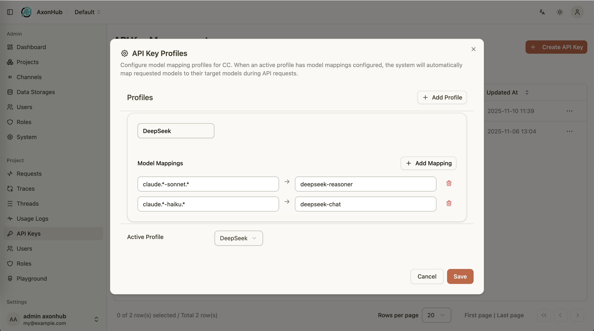

# Codex Integration Guide

---

## Overview
AxonHub can act as a drop-in replacement for OpenAI endpoints, letting Codex connect through your own infrastructure. This guide explains how to configure Codex and how to combine it with AxonHub model profiles for flexible routing.

### Key Points
- AxonHub performs AI protocol/format transformation. You can configure multiple upstream channels (providers) and expose a single OpenAI-compatible interface for Codex.
- You can aggregate Codex requests from the same conversation by enabling `server.trace.codex_trace_enabled` (uses `Session_id`) or adding extra headers via `server.trace.extra_trace_headers`.

### Prerequisites
- AxonHub instance reachable from your development machine.
- Valid AxonHub API key with project access.
- Access to Codex (OpenAI compatible) application.
- Optional: one or more model profiles configured in the AxonHub console.

### Configure Codex
1. Edit `${HOME}/.codex/config.toml` and register AxonHub as a provider:
   ```toml
   model = "gpt-5"
   model_provider = "axonhub-responses"

   [model_providers.axonhub-responses]
   name = "AxonHub using Chat Completions"
   base_url = "http://127.0.0.1:8090/v1"
   env_key = "AXONHUB_API_KEY"
   wire_api = "responses"
   query_params = {}
   ```
2. Export the API key for Codex to read:
   ```bash
   export AXONHUB_API_KEY="<your-axonhub-api-key>"
   ```
3. Restart Codex to apply the configuration.

#### Trace aggregation by conversation (important)
Enable the built-in Codex trace extraction to reuse the `Session_id` header as the trace ID:

```yaml
server:
  trace:
    codex_trace_enabled: true
```

If Codex sends a different stable conversation identifier header (for example `Conversation_id`), you can configure AxonHub to use it as a fallback trace header in `config.yml`:

```yaml
server:
  trace:
    extra_trace_headers:
      - Conversation_id
```

**Note**: Enabling this also ensures that requests from the same trace are prioritized to be sent to the same upstream channel, significantly improving provider-side cache hit rates (e.g., Anthropic Prompt Caching).

#### Testing
- Send a sample prompt; AxonHub's request logs should show a `/v1/chat/completions` call.
- Enable tracing in AxonHub to inspect prompts, responses, and latency.

### Working with Model Profiles
AxonHub model profiles remap incoming model names to provider-specific equivalents:
- Create a profile in the AxonHub console and add mapping rules (exact name or regex).
- Assign the profile to your API key.
- Switch active profiles to alter Codex behavior without changing tool settings.

<table>
  <tr align="center">
    <td align="center">
      <a href="../../screenshots/axonhub-profiles.png">
        
      </a>
      <br/>
      Model Profiles
    </td>
  </tr>
</table>

#### Example
- Request `gpt-4` → mapped to `deepseek-reasoner` for getting more accurate responses.
- Request `gpt-3.5-turbo` → mapped to `deepseek-chat` for reducing costs.

### Troubleshooting
- **Codex reports authentication errors**: ensure `AXONHUB_API_KEY` is exported in the same shell session that launches Codex.
- **Unexpected model responses**: review active profile mappings in the AxonHub console; disable or adjust rules if necessary.

---

## Provider Quota Tracking

AxonHub automatically tracks quota usage for Codex provider channels, displaying the current status with battery icons in the interface.

### How It Works

- **Automatic Polling**: AxonHub periodically polls your Codex account to check quota status
- **Storage**: Quota data is stored in the database and updated based on the configured check interval
- **Visual Indicators**: Battery icons show your remaining quota at a glance.

### Quota Windows

Codex uses multiple quota windows:
- **Primary window**: Main usage limit with a configurable duration (e.g., 5 hours, 1 day)
- **Secondary window**: Optional secondary usage limit with its own duration and reset schedule

The system shows both window percentages including the primary window duration and reset time.

### Configuration

Adjust the quota check interval in `config.yml`:

```yaml
provider_quota:
  check_interval: "20m"          # Check every 20 minutes (default)
```

Or via environment variable:

```bash
export AXONHUB_PROVIDER_QUOTA_CHECK_INTERVAL="30m"
```

Supported intervals: `1m`, `2m`, `3m`, `4m`, `5m`, `6m`, `10m`, `12m`, `15m`, `20m`, `30m`, `1h`, `2h`, etc.

**Recommendations:**
- **Development**: Use shorter intervals (e.g., `5m`) for quick feedback
- **Production**: Use `20m` or longer to reduce API calls

### Refreshing Quota Data

You can manually trigger a quota refresh by clicking the refresh icon in the quota status popover.

### Viewing Quota Status

1. Look for the battery icon next to the settings gear in the header
2. Click the battery icon to view detailed quota information including:
   - Primary window usage percentage and duration
   - Primary window reset time
   - Plan type (if available)
   - Secondary window usage (if configured)

### Related Documentation
- [Tracing Guide](tracing.md)
- [OpenAI API](../api-reference/openai-api.md)
- README sections on [Usage Guide](../../../README.md#usage-guide)
