# Request Processing Guide

This guide is for AxonHub users who want to understand what happens after a request enters `internal/server/orchestrator`, which settings influence the outcome, and where to look first when behavior does not match expectations.

If you want to understand why a request used a specific channel, why the model name changed, or why retry kicked in, start here.

## One-Sentence Summary

AxonHub first converts the client request into a unified internal request, then selects the best upstream channel through API key rules, model mapping, channel filtering, load balancing, and retry policy, and finally transforms the response back into a client-compatible format while recording requests, executions, latency, and usage.

## End-to-End Flow

```mermaid
flowchart LR
    A[Client Request] --> B[Inbound Transform]
    B --> C[Quota and Model Access Checks]
    C --> D[Model Mapping]
    D --> E[Candidate Channel Selection]
    E --> F[Prompt Injection and Protection]
    F --> G[Persist Request]
    G --> H[Channel Load Balancing]
    H --> I[Request Overrides and Transform Options]
    I --> J[Execution Record and Connection Tracking]
    J --> K[Call Upstream Provider]
    K --> L[Retry / Failover]
    L --> M[Response Transform]
    M --> N[Persist Completion, Usage, and Latency]
    N --> O[Return to Client]
```

## Stage-by-Stage Breakdown

### 1. Inbound Transform

AxonHub first converts the raw HTTP request into a unified internal request object.

- Different protocols such as OpenAI, Anthropic, and Gemini are normalized first.
- Raw headers, raw body, and stream mode are preserved for persistence, retry, and debugging.
- Search requests and standard LLM requests use different middleware branches, but share the same orchestrator structure.

At the end of this stage, the system already knows which model was requested, whether the request is streaming, and what content was sent.

### 2. Quota and Model Access Checks

For standard LLM requests, AxonHub performs two early checks:

- API key profile quota enforcement
- API key profile model access enforcement

If the active API key profile defines a quota window or an allowed model list, the request is accepted or rejected here before any upstream routing happens.

For users, this means:

- If you receive `quota_exceeded`, inspect the API key profile quota window first.
- If a model looks configured but is still unavailable, check whether the profile allows it.

### 3. Model Mapping

During model mapping, AxonHub maps the model name from the client request into the internal routable model, and later maps it again into the actual model name required by the selected channel.

Common uses:

- Map a unified model name to different provider model names
- Switch the underlying model without changing client code
- Give different channels different model aliases

This stage explains why the model you send may differ from the model shown in a channel execution record.

### 4. Candidate Channel Selection

Once the model is known, AxonHub filters which channels are eligible to handle the request.

For standard LLM requests, candidate filtering can include:

- Model associations
- API key profile channel ID restrictions
- API key profile channel tag restrictions
- Stream policy
- Anthropic / Gemini native tools capability

Search requests use a simpler path and directly filter enabled search channels that support the requested model.

If no candidates survive this stage, the request usually fails as model unavailable. In practice, that often means:

- The model is not attached to any enabled channel
- The API key profile narrowed the allowed channels too much
- A streaming request was filtered out by channel stream policy

### 5. Prompt Injection and Prompt Protection

Standard LLM requests also pass through two prompt-related stages:

- Prompt Injection: enabled prompts are matched by project and model, then appended to the request
- Prompt Protection: prompt protection rules inspect the request and may block it

This affects the real prompt sent upstream. If the same client request behaves differently inside AxonHub, inspect project prompts and prompt protection rules.

### 6. Request Persistence

Before any upstream call is made, AxonHub creates a Request record.

This record represents the user-facing request itself and usually contains:

- The normalized request
- The raw request body and protocol format
- Links to trace, thread, selected channel, and later execution records

This is why you can usually see a Request in the console even if upstream execution fails later.

### 7. Channel Load Balancing

Only after candidates are known does AxonHub decide which channel to try first.

The effective load-balancing mode comes from two layers:

- System retry / load-balancing defaults
- API key profile overrides

The current implementation supports three main modes:

- `adaptive`: combines trace affinity, error awareness, weighted round robin, and connection load
- `failover`: favors primary/backup behavior
- `circuit_breaker`: emphasizes model-level failure avoidance

The key distinction is:

- Candidate selection decides which channels may participate
- Load balancing decides the order in which those candidates are attempted

These are separate stages.

### 8. Request Overrides and Transform Options

After a channel is selected, AxonHub transforms the unified request into the exact shape required by that channel and applies channel-level settings:

- Request Override Body
- Request Override Headers
- Transform Options

Common effects include:

- Renaming unified fields into provider-specific fields
- Adding or removing headers
- Dynamically rendering templates from model name, metadata, or `reasoning_effort`
- Forcing array formats
- Replacing the `developer` role with `system`

If a request only behaves strangely on one specific channel, inspect that channel's override and transform options first.

### 9. Execution Record, Connection Tracking, and Upstream Call

Right before the upstream request is sent, AxonHub creates a Request Execution record. This represents one actual execution attempt on one concrete channel.

This layer records:

- The selected channel
- The actual model sent upstream
- Execution status
- First-token latency and total latency
- Streaming completion state

At the same time, connection counts are tracked and later fed back into connection-aware load balancing.

### 10. Retry, Failover, and Model Circuit Breaking

If the upstream call fails, the pipeline can retry on later candidates or retry a limited number of times on the same channel, depending on policy.

This is influenced by:

- Whether retry is enabled
- Maximum channel retries
- Maximum retries on a single channel
- Retry delay
- The active load-balancing mode

In some modes, the system also tracks model-level circuit-breaker state and lowers the priority of failing model/channel pairs.

For users, this explains two common observations:

- One client request can produce multiple Request Execution records
- The same model can be healthy on one channel and unhealthy on another

### 11. Response Transform, Streaming Finalization, and Persistence

After the upstream provider responds, AxonHub performs the reverse transform and converts the response back into the protocol the client expects.

At this stage, the system also:

- Aggregates streaming chunks and decides whether the stream actually completed
- Updates Request / Request Execution status
- Writes usage logs
- Stores response bodies, error details, and latency metrics

Even if the client disconnects early, AxonHub still tries to finish persistence in the background so the console can show as much of the execution result as possible.

## Which Settings Most Influence Outcomes

If you want to understand why the system behaved a certain way, inspect these settings first:

1. API Key Profiles: quotas, allowed models, allowed channels, channel tags, and load-balancing overrides.
2. Model management and model associations: which channels and actual models a requested model can resolve to.
3. Channel settings: upstream URL, weight, streaming support, overrides, and transform options.
4. System retry policy: retry order, limits, and delays after failure.
5. Project-level Prompts and Prompt Protection: the final prompt content sent upstream.
6. Trace / Thread headers: affect observability and also trace-aware routing behavior.

## Recommended Troubleshooting Order

### Model unavailable

Check in this order:

1. Whether the API key profile allows the model
2. Whether the model is attached to any enabled channel
3. Whether candidate channels were filtered out by tags, channel IDs, or stream policy
4. Whether the request went to the search API instead of a standard LLM API

### Request always uses the same channel

Check:

1. Whether the same Trace ID is being reused
2. Whether only one candidate channel actually remains
3. Whether weight, error history, or connection load keeps one channel highest-ranked
4. Whether the active mode is `failover`

### Upstream parameters differ from client parameters

Check:

1. Model mapping
2. Prompt Injection
3. Request Override Body / Headers
4. Transform Options

### The console shows a Request but no successful result

This usually means the request entered the system but failed during one of these stages:

- No candidate channels
- Upstream call failed
- Streaming response was interrupted
- All retries failed

When that happens, inspect Request, Request Execution, and Trace together.

## Suggested Reading Order

If this is your first time building a full mental model of AxonHub, read in this order:

1. This guide: the end-to-end request lifecycle
2. Channel Management Guide: how channel settings change outcomes
3. Load Balancing Guide: how candidates are ranked and switched
4. Request Override Guide: why upstream parameters may differ
5. Tracing Guide: how to reconstruct a full request path in the console

## Related Documentation

- [Channel Management Guide](channel-management.md)
- [Load Balancing Guide](load-balance.md)
- [Request Override Guide](request-override.md)
- [Tracing Guide](tracing.md)
- [API Key Profiles Guide](api-key-profiles.md)
- [Model Management Guide](model-management.md)
- [Transformation Flow Architecture](../development/transformation-flow.md)
