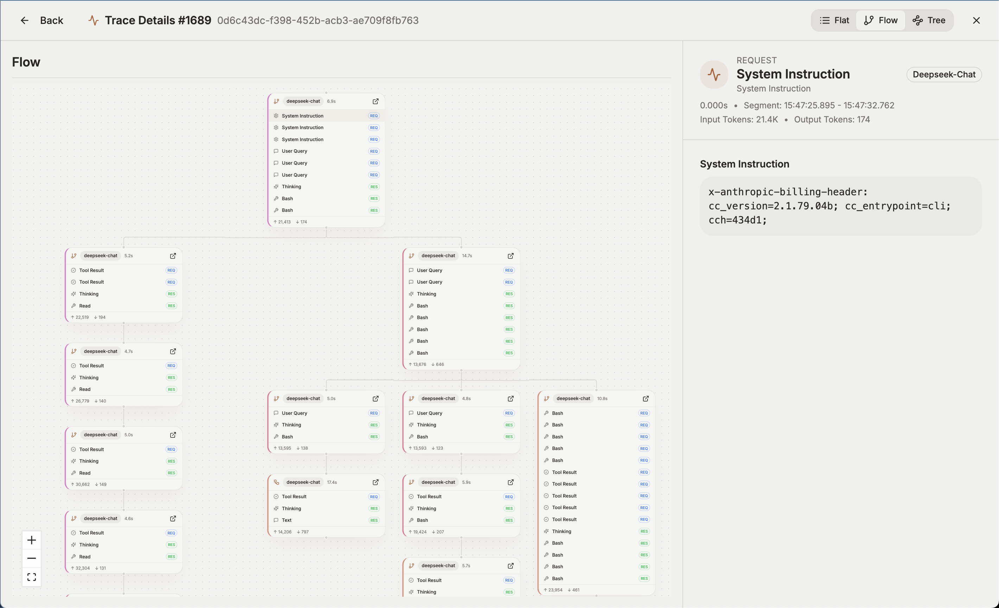

# Tracing Guide

---

### Overview
AxonHub captures every inbound request in a thread-aware trace without forcing you to adopt a new SDK. If your client already speaks the OpenAI-compatible protocol, you can opt into observability simply by forwarding trace and thread headers—or rely on AxonHub to create them for you automatically.

Key benefits of using tracing include:
- **Observability**: Gain clear visibility into every user message and all associated agent requests.
- **Performance Optimization**: AxonHub prioritizes routing requests within the same Trace to the same upstream channel. This significantly improves provider-side cache hit rates (e.g., Anthropic's Prompt Caching), reducing latency and lowering costs.
- **Efficient Debugging**: Reconstruct the full conversation context using Thread IDs to quickly pinpoint issues in multi-turn interactions.

### Key Concepts
- **Thread ID (`AH-Thread-Id`)** – Represents a complete user conversation session. Links multiple traces together so you can follow the entire user journey across multiple messages.
- **Trace ID (`AH-Trace-Id`)** – Represents a single user message and all the agent requests it triggers. You must provide this header when you need multiple requests to be linked; omitting it causes AxonHub to record requests separately even though it can auto-generate IDs.
- **Request** – The smallest unit of a single API call, containing complete request/response data, latency, token usage, and other details.
- **Extra Trace Headers** – Configure fallbacks (e.g. `Sentry-Trace`) to reuse existing observability tooling.

### Thread, Trace, and Request Relationship

```
Thread (complete user conversation session)
  └── Trace 1 (user message 1 + all agent requests)
        ├── Request 1 (agent call 1)
        ├── Request 2 (agent call 2)
        └── Request 3 (agent call 3)
  └── Trace 2 (user message 2 + all agent requests)
        ├── Request 4 (agent call 4)
        └── Request 5 (agent call 5)
```

- **Thread**: Represents a complete user conversation session, containing multiple user messages (each message corresponds to a trace)
- **Trace**: Represents a single user message and all the agent requests it triggers during processing
- **Request**: Represents a single API call to an LLM or other service, containing detailed information such as request body, response body, and token usage

**Hierarchy**:
- 1 Thread can contain multiple Traces (one trace per user message)
- 1 Trace can contain multiple Requests (all agent calls triggered by that message)
- 1 Request can only belong to 1 Trace
- 1 Trace can only belong to 1 Thread (optional association)

**Practical Use Cases**:
- **Single message with agent**: 1 Thread → 1 Trace → N Requests (user sends one message, agent makes multiple API calls)
- **Multi-turn conversation**: 1 Thread → Multiple Traces (one trace per user message) → N Requests per trace
- **Independent request**: No Thread → 1 Trace → 1 Request (single API call without conversation context)

### Configuration
```yaml
# config.yml
trace:
  thread_header: "AH-Thread-Id"
  trace_header: "AH-Trace-Id"
  extra_trace_headers:
    - "Sentry-Trace"
```

- Set `extra_trace_headers` to reuse existing instrumentation headers.
- Leave headers empty to fall back to the defaults shown above.

### Using Tracing with OpenAI-Compatible Clients
```bash
curl https://your-axonhub-instance/v1/chat/completions \
  -H "Authorization: Bearer ${AXONHUB_API_KEY}" \
  -H "Content-Type: application/json" \
  -H "AH-Trace-Id: at-demo-123" \
  -H "AH-Thread-Id: thread-abc" \
  -d '{
    "model": "gpt-4o",
    "messages": [
      { "role": "user", "content": "Diagnose latency in my pipeline" }
    ]
  }'
```

- Provide `AH-Trace-Id` when you need sequential requests to appear under the same trace. Without it AxonHub will log them independently, even though autogenerated IDs are available for standalone calls.
- All standard OpenAI SDKs work out of the box—no code changes beyond optional header injection.

### SDK Examples
Looking for complete runnable samples? See `integration_test/openai/trace_multiple_requests/trace_test.go` and `integration_test/anthropic/trace_multiple_requests/trace_test.go`. The snippets below extract the essentials for production code.

#### OpenAI Go SDK
```go
package traces

import (
    "context"

    "github.com/openai/openai-go/v3"
    "github.com/openai/openai-go/v3/option"
)

func sendTracedChat(ctx context.Context, apiKey string) (*openai.ChatCompletion, error) {
    client := openai.NewClient(
        option.WithAPIKey(apiKey),
        option.WithBaseURL("https://your-axonhub-instance/v1"),
    )

    params := openai.ChatCompletionNewParams{
        Model: openai.ChatModel("gpt-4o"),
        Messages: []openai.ChatCompletionMessageParamUnion{
            openai.UserMessage("Diagnose latency in my pipeline"),
        },
    }

    // Pass trace and thread headers at request level
    return client.Chat.Completions.New(ctx, params,
        option.WithHeader("AH-Trace-Id", "trace-example-123"),
        option.WithHeader("AH-Thread-Id", "thread-example-abc"),
    )
}
```

#### Anthropic Go SDK
```go
package traces

import (
    "context"

    anthropic "github.com/anthropics/anthropic-sdk-go"
    "github.com/anthropics/anthropic-sdk-go/option"
)

func sendTracedMessage(ctx context.Context, apiKey string) (*anthropic.Message, error) {
    client := anthropic.NewClient(
        option.WithAPIKey(apiKey),
        option.WithBaseURL("https://your-axonhub-instance/anthropic"),
    )

    params := anthropic.MessageNewParams{
        Model: anthropic.Model("claude-3-5-sonnet"),
        Messages: []anthropic.MessageParam{
            anthropic.NewUserMessage(
                anthropic.NewTextBlock("Diagnose latency in my pipeline"),
            ),
        },
    }

    // Pass trace and thread headers at request level
    return client.Messages.New(ctx, params,
        option.WithHeader("AH-Trace-Id", "trace-example-123"),
        option.WithHeader("AH-Thread-Id", "thread-example-abc"),
    )
}
```

### Data Storage for Trace Payloads
- Decide whether to keep full request/response bodies by adjusting your storage policy. Disable it if you only need metadata.
- Configure a default storage location in the admin console; AxonHub will fall back to the primary storage if the preferred option is unavailable.
- Large payloads can live in external storage (local disk, S3, or GCS) so traces stay responsive even when responses are big.

### Claude Code Trace Support
- Turn on Claude Code extraction with `server.trace.claude_code_trace_enabled: true` so AxonHub can pick up trace IDs automatically.
- The `/anthropic/v1/messages` (and `/v1/messages`) endpoint will reuse the Claude Code `metadata.user_id` as the trace ID while keeping your payload untouched for downstream usage.
- If you already send a trace header, AxonHub keeps your value—manual instrumentation and auto-extraction work together.

### Codex Trace Support
- Turn on Codex extraction with `server.trace.codex_trace_enabled: true` so AxonHub can reuse the `Session_id` header as the trace ID.
- If you already send a trace header, AxonHub keeps your value—manual instrumentation and auto-extraction work together.

### Exploring Traces in the Console
1. Navigate to **Traces** in the AxonHub admin console.
2. Filter by project, model, or time range to locate the trace of interest.
3. Expand a trace to inspect spans, prompt/response payloads, timing, and channel metadata.
4. Jump to the linked thread to review the overall conversation timeline alongside trace details.

<table>
  <tr align="center">
    <td align="center">
      <a href="../../screenshots/axonhub-trace.png">
        
      </a>
      <br/>
      The Trace details page displays the request timeline, token usage, and cache hit status
    </td>
  </tr>
</table>

### Best Practices

#### Trace Design Recommendations

**Keep Reasonable Number of Requests per Trace**

While AxonHub theoretically supports unlimited requests per trace, we recommend the following limits in production:

- **Recommended range**: 10-50 requests per trace
- **Acceptable range**: Up to 100 requests
- **Avoid**: More than 1000 requests in a single trace

**Reasons**:
- **Memory consumption**: Each request body typically ranges from 1-5MB, so 100 requests could consume ~500MB memory
- **Performance impact**: Too many requests slow down trace page loading, affecting user experience
- **Readability**: Traces with hundreds of requests are difficult to navigate and debug

**Optimization Tips**:
1. **Split workflows**: Break down complex agent workflows into multiple traces, each representing a logical unit
2. **Use Thread linkage**: Associate multiple traces via Thread ID to maintain conversation continuity
3. **Limit agent iterations**: Set reasonable maximum iteration counts in agent loops to avoid infinite cycles
4. **Implement cleanup**: Set data retention policies to periodically clean up old trace data

**Example Scenarios**:

✅ **Good Practice**:
```
Thread (User Session)
  ├── Trace 1: Problem Analysis (5 requests)
  ├── Trace 2: Solution Design (10 requests)
  ├── Trace 3: Code Generation (20 requests)
  └── Trace 4: Result Validation (8 requests)
```

❌ **Avoid**:
```
Thread (User Session)
  └── Trace: Complete Workflow (500+ requests)
```

#### Request Body Size Control

- For requests with large context, consider using Prompt Caching (e.g., Anthropic's caching feature)
- Avoid storing unnecessary large files in Request Bodies (e.g., complete log files)
- For large media files like images and videos, use URL references instead of base64 encoding

### Troubleshooting
- **No trace recorded** – Ensure the request is authenticated and the project ID is resolved (API Key must belong to a project).
- **Missing thread linkage** – Provide `AH-Thread-Id` or create threads via the API before sending requests.
- **Unexpected trace IDs** – Check for upstream reverse proxies overriding headers.

### Related Documentation
- [Request Processing Guide](request-processing.md)
- [Load Balancing Guide](load-balance.md)
