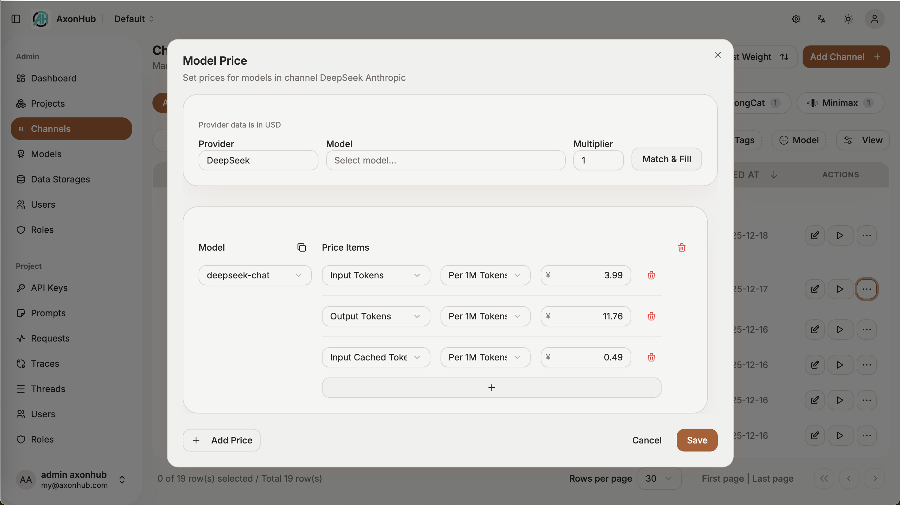

# 成本追踪

AxonHub 为每一次请求提供实时的成本计算和用量追踪。

## 概述

AxonHub 的成本追踪功能帮助您监控和控制跨所有供应商和模型的 AI 支出。每个请求都会被自动分析，并根据可配置的定价计算成本。

## 功能特性

### Token 类型追踪

AxonHub 追踪以下 Token 类型：

| Token 类型 | 说明 | 代码标识 |
|------------|------|----------|
| **输入 (Prompt)** | 发送到模型的 Token（不含缓存 Token） | `prompt_tokens` |
| **输出 (Completion)** | 模型生成的 Token | `completion_tokens` |
| **缓存读取** | 从缓存读取的 Token | `prompt_cached_tokens` |
| **缓存写入** | 写入缓存的 Token | `prompt_write_cached_tokens` |
| **推理** | 推理 Token（支持该功能的模型）| `completion_reasoning_tokens` |
| **缓存写入 (5分钟)** | Anthropic 5分钟 TTL 缓存写入 | `prompt_write_cached_tokens_5m` |
| **缓存写入 (1小时)** | Anthropic 1小时 TTL 缓存写入 | `prompt_write_cached_tokens_1h` |

### 定价模式

AxonHub 支持三种定价模式：

| 模式 | 说明 | 适用场景 |
|------|------|----------|
| **固定费用 (flat_fee)** | 每次请求收取固定费用 | 固定成本场景 |
| **按单位计费 (usage_per_unit)** | 按每百万 Token 计费 | 大多数模型 |
| **分层计费 (usage_tiered)** | 根据用量分层定价 | 用量折扣场景 |

### 成本明细

每个请求都包含详细的成本明细：

```json
{
  "costItems": [
    {
      "itemCode": "prompt_tokens",
      "quantity": 1000,
      "subtotal": 0.0015
    },
    {
      "itemCode": "completion_tokens",
      "quantity": 500,
      "subtotal": 0.0020
    },
    {
      "itemCode": "prompt_cached_tokens",
      "quantity": 2000,
      "subtotal": 0.0005
    }
  ],
  "totalCost": 0.0050
}
```

### 分层定价明细

使用分层定价时，成本明细包含层级分解：

```json
{
  "itemCode": "prompt_tokens",
  "quantity": 150000,
  "tierBreakdown": [
    {
      "upTo": 100000,
      "units": 100000,
      "subtotal": 0.1000
    },
    {
      "upTo": null,
      "units": 50000,
      "subtotal": 0.0750
    }
  ],
  "subtotal": 0.1750
}
```

## 配置

### 模型定价

在管理后台为每个渠道和模型配置定价：

1. 进入 **渠道** → **模型价格**
2. 为每个模型设置定价项目：



   - 输入价格 (`prompt_tokens`)
   - 输出价格 (`completion_tokens`)
   - 缓存读取价格 (`prompt_cached_tokens`)
   - 缓存写入价格 (`prompt_write_cached_tokens`)

#### 缓存写入变体（Anthropic）

对于 Anthropic 模型，可以配置缓存写入的 TTL 变体：
- **5分钟** (`five_min`): 短期缓存
- **1小时** (`one_hour`): 长期缓存

### 成本计算逻辑

1. **输入 Token 计算**: `PromptTokens - CachedTokens - WriteCachedTokens`
   - 缓存 Token 单独计费，不计入输入 Token 成本

2. **缓存写入变体处理**:
   - 如果存在 `WriteCached5MinTokens` 或 `WriteCached1HourTokens`，分别使用对应变体价格
   - 否则使用默认的缓存写入价格

3. **价格版本控制**:
   - 每次价格变更都会创建新的版本记录
   - 使用日志通过 `cost_price_reference_id` 关联到具体价格版本

## 查看成本

### 使用日志

每个请求的使用日志包含：

- **Token 用量**: prompt_tokens, completion_tokens, total_tokens
- **Token 详情**: 各类细分 Token 数量
- **成本信息**: total_cost, cost_items, cost_price_reference_id

### GraphQL API

查询使用日志及成本信息：

```graphql
query GetUsageLogs {
  usageLogs {
    edges {
      node {
        modelId
        promptTokens
        completionTokens
        totalTokens
        totalCost
        costItems {
          itemCode
          quantity
          subtotal
          tierBreakdown {
            upTo
            units
            subtotal
          }
        }
        costPriceReferenceId
      }
    }
  }
}
```

### 成本字段说明

| 字段 | 类型 | 说明 |
|------|------|------|
| `totalCost` | Float | 总成本（基于渠道模型价格计算） |
| `costItems` | JSON | 成本明细项目数组 |
| `costPriceReferenceId` | String | 用于成本计算的价格版本引用 ID |

## 最佳实践

1. **配置模型价格**: 在使用前为每个渠道和模型配置准确的价格
2. **监控缓存使用**: 缓存可以显著降低成本，监控缓存命中率
3. **使用价格版本**: 价格变更时会自动创建版本，便于成本追溯
4. **定期审查**: 查看使用日志和成本报告以优化使用

## 故障排除

### 缺少成本数据

如果成本未显示：

1. 确认渠道模型价格已配置
2. 检查供应商是否返回 Token 使用量
3. 查看使用日志中的 `costPriceReferenceId` 是否正确

### 成本不正确

如果成本似乎不正确：

1. 验证定价配置（特别是缓存价格）
2. 检查使用日志中的 Token 数量明细
3. 确认是否使用了正确的价格版本
4. 对于分层定价，检查层级配置是否正确
