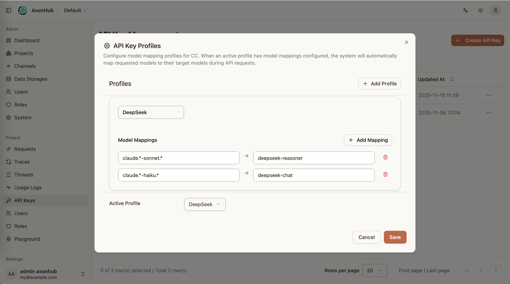

# OpenCode 集成指南

---

## 概述

AxonHub 可以作为 Anthropic 端点的无缝替代方案，让 OpenCode 通过您自己的基础设施进行连接。本指南说明了如何配置 OpenCode 以及如何将其与 AxonHub 模型配置（Model Profiles）结合使用，以实现灵活的路由。

### 核心点

- AxonHub 执行 AI 协议/格式转换。您可以配置多个上游渠道（供应商），并为 OpenCode 暴露一个统一的 Anthropic 兼容接口。
- 您可以将来自同一会话的 OpenCode 请求聚合到一个追踪（Trace）中（参见“配置 OpenCode”）。

### 前提条件

- 可从您的开发机器访问的 AxonHub 实例。
- 具有项目访问权限的有效 AxonHub API 密钥。
- 访问 OpenCode CLI 工具。
- 可选：在 AxonHub 控制台中配置的一个或多个模型配置（Model Profiles）。

---

## 配置 OpenCode

### 1. 创建 OpenCode 配置文件

在 `~/.config/opencode/opencode.json` 创建或编辑您的 OpenCode 配置文件：

```json
{
  "$schema": "https://opencode.ai/config.json",
  "plugin": [
    "opencode-axonhub-tracing"
  ],
  "provider": {
    "axonhub": {
      "npm": "@ai-sdk/anthropic",
      "name": "AxonHub",
      "options": {
        "baseURL": "http://127.0.0.1:8090/anthropic/v1",
        "apiKey": "AXONHUB_API_KEY"
      },
      "models": {
        "claude-sonnet-4-5": {
          "name": "AxonHub - Claude Sonnet 4.5",
          "modalities": {
            "input": [
              "text",
              "image"
            ],
            "output": [
              "text"
            ]
          }
        }
      }
    }
  }
}
```

### 2. 配置参数

| 参数 | 描述 | 示例 |
|-----------|-------------|---------|
| `npm` | 用于提供商的 npm 包 | `@ai-sdk/anthropic` |
| `name` | 提供商的显示名称 | `AxonHub` |
| `baseURL` | AxonHub Anthropic API 端点 | `http://127.0.0.1:8090/anthropic/v1` |
| `apiKey` | 您的 AxonHub API 密钥 | 将 `AXONHUB_API_KEY` 替换为您的实际密钥 |

### 3. 添加多个模型

您可以在同一个提供商中配置多个模型：

```json
{
  "provider": {
    "axonhub": {
      "npm": "@ai-sdk/anthropic",
      "name": "AxonHub",
      "options": {
        "baseURL": "http://127.0.0.1:8090/anthropic/v1",
        "apiKey": "your-axonhub-api-key"
      },
      "models": {
        "claude-sonnet-4-5": {
          "name": "AxonHub - Claude Sonnet 4.5",
          "modalities": {
            "input": ["text", "image"],
            "output": ["text"]
          }
        },
        "claude-haiku-4-5": {
          "name": "AxonHub - Claude Haiku 4.5",
          "modalities": {
            "input": ["text", "image"],
            "output": ["text"]
          }
        },
        "claude-opus-4-5": {
          "name": "AxonHub - Claude Opus 4.5",
          "modalities": {
            "input": ["text", "image"],
            "output": ["text"]
          }
        }
      }
    }
  }
}
```

### 4. 使用远程 AxonHub 实例

如果您的 AxonHub 实例部署在远程，请更新 `baseURL`：

```json
{
  "options": {
    "baseURL": "https://your-axonhub-domain.com/anthropic/v1",
    "apiKey": "your-axonhub-api-key"
  }
}
```

---

## 使用模型配置（Model Profiles）

AxonHub 模型配置可以将传入的模型名称重映射为特定提供商的等效名称：
- 在 AxonHub 控制台中创建一个配置，并添加映射规则（精确名称或正则表达式）。
- 将该配置分配给您的 API 密钥。
- 切换活跃的配置以更改 OpenCode 行为，而无需更改工具设置。

<table>
  <tr align="center">
    <td align="center">
      <a href="../../screenshots/axonhub-profiles.png">
        
      </a>
      <br/>
      模型配置
    </td>
  </tr>
</table>

### 示例用例

#### 成本优化
将昂贵的模型映射到更便宜的替代方案：
- 请求 `claude-sonnet-4-5` → 映射到 `deepseek-chat` 以降低成本
- 请求 `claude-haiku-4-5` → 映射到 `gpt-4o-mini` 处理简单任务

#### 性能优化
针对特定任务路由到更快的模型：
- 请求 `claude-opus-4-5` → 映射到 `claude-sonnet-4-5` 以获得更快的响应
- 请求 `claude-sonnet-4-5` → 映射到 `gpt-4o` 以获得更好的可用性

#### 高级推理
路由到专门的模型：
- 请求 `claude-sonnet-4-5` → 映射到 `deepseek-reasoner` 处理复杂的推理任务
- 请求 `claude-opus-4-5` → 映射到 `o1-preview` 处理数学问题

---

## OpenCode 追踪插件

`opencode-axonhub-tracing` 插件为每个 LLM 请求注入追踪头部（trace headers），实现在 AxonHub 中的请求聚合和追踪。

### 默认 Headers

| Header Key | 来源 | 描述 |
|------------|------|------|
| `AH-Thread-Id` | OpenCode `sessionID` | 将同一会话的请求分组 |
| `AH-Trace-Id` | OpenCode `message.id` | 每条消息的唯一标识符 |

### 启用插件

在 `opencode.json` 中添加插件：

```json
{
  "$schema": "https://opencode.ai/config.json",
  "plugin": ["opencode-axonhub-tracing"]
}
```

OpenCode 会在需要时自动安装插件。

### 自定义 Header 配置（可选）

默认情况下，插件使用 `AH-Thread-Id` 和 `AH-Trace-Id` 作为 header key。您可以通过环境变量覆盖：

| 环境变量 | 默认值 | 描述 |
|----------|--------|------|
| `OPENCODE_AXONHUB_TRACING_THREAD_HEADER` | `AH-Thread-Id` | 自定义线程 header key |
| `OPENCODE_AXONHUB_TRACING_TRACE_HEADER` | `AH-Trace-Id` | 自定义追踪 header key |

示例：

```bash
export OPENCODE_AXONHUB_TRACING_THREAD_HEADER="X-Thread-Id"
export OPENCODE_AXONHUB_TRACING_TRACE_HEADER="X-Trace-Id"
```

> **注意**：空字符串值会自动回退到默认 key。

### 行为说明

- **Thread ID**：使用 OpenCode 的 `sessionID` 对相关请求进行分组
- **Trace ID**：使用 OpenCode 当前用户消息的 `message.id` 进行唯一标识
- 如果当前消息没有 `id`，则仅注入 thread header

### 收益

- **会话聚合**：在 AxonHub 追踪中将同一 OpenCode 会话的相关请求分组
- **请求关联**：在 AI 基础设施中追踪单个消息
- **灵活配置**：自定义 header key 以匹配现有的追踪基础设施

---

## 故障排除

### OpenCode 无法连接

**症状**：连接错误、超时错误

**解决方案**：
1. 验证 `baseURL` 指向正确的 AxonHub 端点
2. 检查 AxonHub 是否正在运行：`curl http://localhost:8090/health`
3. 验证防火墙是否允许出站连接
4. 对于使用自签名证书的 HTTPS 端点，配置信任设置

### 身份验证错误

**症状**：401 Unauthorized、403 Forbidden

**解决方案**：
1. 验证您的 API 密钥在配置中是否正确
2. 在 AxonHub 控制台中检查 API 密钥是否已过期
3. 确保 API 密钥具有所请求项目的访问权限
4. 验证 API 密钥具有所请求模型的权限

### 意外的模型响应

**症状**：错误的模型响应、意外行为

**解决方案**：
1. 在 AxonHub 控制台中查看活跃的配置映射
2. 检查渠道配置和模型关联
3. 验证请求的模型名称是否与您的配置匹配
4. 如果有必要，禁用或调整配置规则

### 配置未加载

**症状**：OpenCode 使用默认设置，忽略配置文件

**解决方案**：
1. 验证配置文件位置：`~/.config/opencode/opencode.json`
2. 检查 JSON 语法是否有效（使用 JSON 验证器）
3. 确保文件权限允许读取
4. 更改配置后重启 OpenCode

---

## 高级配置

### 多个 AxonHub 提供商

您可以将多个 AxonHub 实例配置为不同的提供商：

```json
{
  "provider": {
    "axonhub-prod": {
      "npm": "@ai-sdk/anthropic",
      "name": "AxonHub Production",
      "options": {
        "baseURL": "https://prod.axonhub.com/anthropic/v1",
        "apiKey": "prod-api-key"
      },
      "models": {
        "claude-sonnet-4-5": {
          "name": "Production - Claude Sonnet 4.5",
          "modalities": {
            "input": ["text", "image"],
            "output": ["text"]
          }
        }
      }
    },
    "axonhub-dev": {
      "npm": "@ai-sdk/anthropic",
      "name": "AxonHub Development",
      "options": {
        "baseURL": "http://localhost:8090/anthropic/v1",
        "apiKey": "dev-api-key"
      },
      "models": {
        "claude-sonnet-4-5": {
          "name": "Development - Claude Sonnet 4.5",
          "modalities": {
            "input": ["text", "image"],
            "output": ["text"]
          }
        }
      }
    }
  }
}
```

### 使用 OpenAI 兼容端点

OpenCode 也可以使用 AxonHub 的 OpenAI 兼容端点：

```json
{
  "provider": {
    "axonhub-openai": {
      "npm": "@ai-sdk/openai",
      "name": "AxonHub OpenAI",
      "options": {
        "baseURL": "http://127.0.0.1:8090/v1",
        "apiKey": "your-axonhub-api-key"
      },
      "models": {
        "gpt-4": {
          "name": "AxonHub - GPT-4",
          "modalities": {
            "input": ["text"],
            "output": ["text"]
          }
        }
      }
    }
  }
}
```

---

## 最佳实践

### 安全
- **切勿提交 API 密钥**：使用环境变量或安全保险库
- **定期轮换密钥**：定期更新 API 密钥
- **在生产环境中使用 HTTPS**：始终对远程实例使用加密连接
- **限制 API 密钥权限**：仅授予必要的权限

### 性能
- **启用追踪聚合**：提高缓存命中率
- **使用合适的模型**：将模型能力与任务复杂度相匹配
- **监控使用情况**：在 AxonHub 控制台中追踪成本和性能
- **配置超时**：为您的用例设置合理的超时值

---

## 相关文档
- [追踪指南](tracing.md)
- [API 密钥配置指南](api-key-profiles.md)
- [模型管理指南](model-management.md)
- [渠道管理指南](channel-management.md)
- [Anthropic API 参考](../api-reference/anthropic-api.md)
- README 中的 [使用指南](../../../README.md#usage-guide)
