# 请求处理流程指南

本文档面向 AxonHub 使用者，说明一个请求进入 `internal/server/orchestrator` 之后会经历哪些阶段、哪些配置会影响最终结果，以及遇到问题时应该优先检查什么。

如果你想理解“为什么这次请求走了这个渠道、为什么模型名被改写了、为什么触发了重试”，这篇文档就是入口。

## 一句话总结

AxonHub 会先把客户端请求转换成统一的内部请求，再按 API Key、模型、渠道、负载均衡和重试策略选出最合适的上游渠道，最后把响应转回客户端兼容格式，并同时记录请求、执行、延迟和用量数据。

## 整体流程

```mermaid
flowchart LR
    A[客户端请求] --> B[入站转换]
    B --> C[额度与模型访问检查]
    C --> D[模型映射]
    D --> E[候选渠道选择]
    E --> F[提示词注入与保护]
    F --> G[请求落库]
    G --> H[渠道负载均衡]
    H --> I[请求重写与转换选项]
    I --> J[执行记录与连接跟踪]
    J --> K[调用上游提供商]
    K --> L[重试 / 故障转移]
    L --> M[响应转换]
    M --> N[请求完成、用量与延迟记录]
    N --> O[返回给客户端]
```

## 分阶段说明

### 1. 入站转换

AxonHub 先根据入口协议把原始 HTTP 请求转换成统一的内部请求对象。

- OpenAI、Anthropic、Gemini 等不同格式会先被统一。
- 原始请求头、请求体、是否流式等信息会保留下来，供后续落库、重试和调试使用。
- 搜索请求和普通 LLM 请求会走不同的中间件分支，但共享同一套 orchestrator 框架。

这一步之后，系统已经知道“用户要的模型是什么、请求是不是流式、消息内容是什么”。

### 2. 额度与模型访问检查

对于普通 LLM 请求，AxonHub 会先做两类快速拒绝：

- API Key Profile 配额检查
- API Key Profile 可访问模型检查

如果当前 API Key 的活跃 Profile 配置了分钟级额度或可访问模型列表，请求会在这一层被直接放行或拒绝。这样可以避免请求已经路由到渠道后才发现无权使用。

对使用者的意义是：

- 收到 `quota_exceeded` 时，优先检查 API Key Profile 的额度窗口。
- 某个模型“明明配置了但还是不可用”时，优先检查 Profile 是否允许该模型。

### 3. 模型映射

在模型映射阶段，AxonHub 会把客户端请求中的模型名映射成系统内部可路由的模型，再在真正发给渠道时映射为该渠道的实际模型名。

常见用途：

- 把统一模型名映射到不同提供商的真实模型名
- 在不改客户端代码的情况下切换底层模型
- 给不同渠道配置不同的模型别名

这一层解释了为什么你请求的是一个模型名，最终在渠道执行记录里看到的是另一个模型名。

### 4. 候选渠道选择

模型确定后，AxonHub 会筛选“哪些渠道有资格处理这次请求”。

普通 LLM 请求会综合以下条件：

- 模型关联关系
- API Key Profile 限定的渠道 ID
- API Key Profile 限定的渠道标签
- 流式策略
- Anthropic / Gemini 原生 tools 能力

搜索请求会走更简化的逻辑，直接在启用的搜索渠道中筛选支持该模型的渠道。

如果这一步没有候选渠道，请求通常会以模型不可用失败。对于用户来说，这通常意味着：

- 模型没有绑定到任何启用渠道
- API Key Profile 把可用渠道进一步收窄了
- 流式请求命中了不支持流式的渠道策略

### 5. 提示词注入与提示词保护

普通 LLM 请求在选出候选渠道前后，还会经过两类内容处理：

- Prompt Injection：按项目和模型匹配已启用提示词，并追加到请求里
- Prompt Protection：按规则审查请求内容，必要时直接拦截

这一步会影响最终送到上游的真实 prompt，因此当你看到“同样的客户端请求，在 AxonHub 中表现不同”时，应该检查项目级提示词和提示词保护规则。

### 6. 请求落库

在真正发出上游请求前，AxonHub 会先创建 Request 记录。

这条记录保存的是“这次用户请求本身”，通常包含：

- 统一后的请求信息
- 原始请求体和协议格式
- 后续关联的 Trace、Thread、渠道和执行记录

这就是为什么在控制台里，即使上游执行失败，你通常也能先看到一条 Request。

### 7. 渠道负载均衡

当候选渠道已经确定，AxonHub 才开始决定“这次先试哪个渠道”。

实际使用的负载均衡策略来自两层配置：

- 系统默认重试/负载均衡策略
- API Key Profile 覆盖策略

当前实现支持三类主模式：

- `adaptive`：综合 trace、一致性、错误率、权重轮询、连接数
- `failover`：更偏主备切换
- `circuit_breaker`：更强调模型级熔断

对用户最重要的理解是：

- “候选渠道选择”决定哪些渠道能参与
- “负载均衡”决定这些候选渠道的尝试顺序

两者不是一回事。

### 8. 请求重写与转换选项

渠道确定后，AxonHub 会把统一请求转换成该渠道真正需要的格式，并应用渠道级配置：

- Request Override Body
- Request Override Headers
- Transform Options

常见影响包括：

- 把统一字段改成提供商私有字段
- 增删请求头
- 根据模型名、元数据、`reasoning_effort` 动态渲染模板
- 强制数组格式
- 将 `developer` 角色替换为 `system`

所以如果一个请求只在某个渠道上表现异常，优先检查该渠道的 override 和 transform options。

### 9. 执行记录、连接跟踪与上游调用

正式调用上游前，AxonHub 会创建 Request Execution 记录，它描述的是“这次请求在某个具体渠道上的一次实际执行”。

这一层会记录：

- 选中的渠道
- 实际发送的模型
- 请求执行状态
- 首 token 延迟和总延迟
- 流式完成情况

同时系统会跟踪连接数，用于后续连接感知负载均衡。

### 10. 重试、故障转移与模型熔断

如果上游请求失败，pipeline 会按重试策略继续尝试后续候选渠道，或者在同一渠道上做有限重试。

这里会受到以下配置影响：

- 是否启用重试
- 最大渠道重试次数
- 单渠道最大重试次数
- 重试延迟
- 当前负载均衡模式

部分模式下，系统还会记录模型级熔断状态，降低故障模型在某个渠道上的优先级。

对用户来说，这解释了两类现象：

- 一次客户端请求可能对应多条 Request Execution
- 同一个模型在不同渠道上的健康度可能不同

### 11. 响应转换、流式收尾与数据记录

上游返回后，AxonHub 会再做一次反向转换，把响应变回客户端期望的协议格式。

在这个阶段，系统还会：

- 聚合流式 chunk，判断流是否真正完成
- 更新 Request / Request Execution 状态
- 记录 usage log
- 记录响应体、错误信息、延迟指标

即使客户端提前断开，AxonHub 也会尽量在后台完成持久化，保证你还能在控制台中看到尽可能完整的执行结果。

## 哪些配置最影响请求结果

如果你想快速理解“为什么系统这样工作”，优先看这几类配置：

1. API Key Profile：决定额度、允许模型、允许渠道、渠道标签和可覆盖的负载均衡策略。
2. 模型管理与模型关联：决定某个请求模型能映射到哪些渠道和真实模型。
3. 渠道配置：决定上游地址、权重、是否支持流式、override、transform options。
4. 系统重试策略：决定失败后的尝试顺序、次数和延迟。
5. 项目级 Prompt / Prompt Protection：决定发送到上游的最终提示词内容。
6. Trace / Thread：会影响可观测性，也会影响 trace-aware 路由行为。

## 常见问题排查顺序

### 模型不可用

建议按这个顺序检查：

1. API Key Profile 是否允许该模型
2. 模型是否绑定到启用渠道
3. 候选渠道是否被标签、渠道 ID 或流式策略过滤掉
4. 该请求是否走了搜索 API，而不是普通 LLM API

### 请求总走同一个渠道

优先检查：

1. 是否携带了相同的 Trace ID
2. 候选渠道是否其实只剩一个
3. 权重、错误率、连接数是否使该渠道持续得分最高
4. 当前是否使用 `failover` 模式

### 上游收到的参数和客户端发出的不一致

优先检查：

1. 模型映射
2. Prompt Injection
3. Request Override Body / Headers
4. Transform Options

### 控制台里有 Request，但没有成功结果

通常意味着请求已经进入系统，但在以下阶段失败：

- 候选渠道为空
- 上游调用失败
- 流式响应中断
- 所有重试都失败

这时应同时查看 Request、Request Execution 和 Trace。

## 推荐的阅读路径

如果你是第一次系统性理解 AxonHub，建议按下面顺序阅读：

1. 本文档：建立完整心智模型
2. 渠道管理指南：理解渠道配置会怎样影响处理结果
3. 负载均衡指南：理解候选渠道是如何排序和切换的
4. 请求重写指南：理解为什么上游看到的参数会变化
5. 追踪指南：理解如何从控制台还原一次完整请求链路

## 相关文档

- [渠道管理指南](channel-management.md)
- [负载均衡指南](load-balance.md)
- [请求重写指南](request-override.md)
- [追踪指南](tracing.md)
- [API 密钥配置指南](api-key-profiles.md)
- [模型管理指南](model-management.md)
- [转换流程架构](../development/transformation-flow.md)
