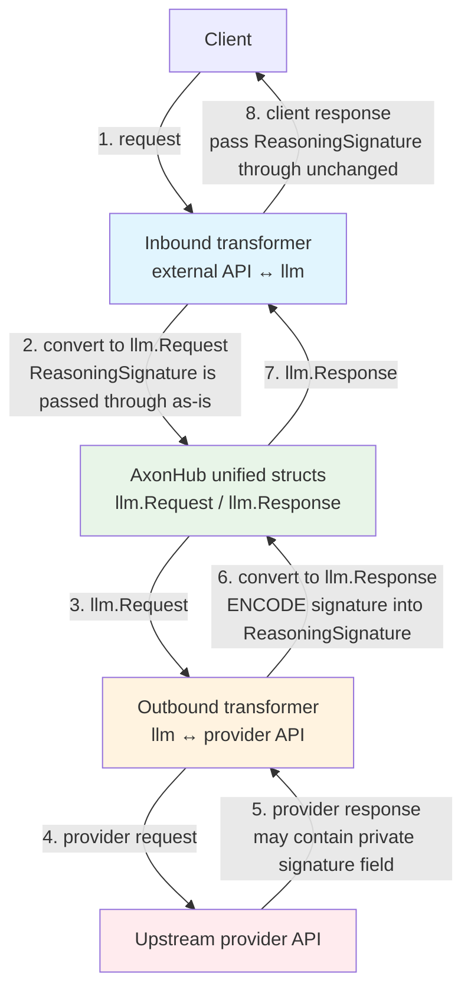

# Shared Transformer Helpers

This folder contains small, provider-agnostic helpers used by multiple transformers.
The most important concept here is the **signature marking** scheme used to make
provider-specific private protocols survive **same-session channel/model switching**.

## Problem: same-session switching breaks provider private protocols

In AxonHub a single user session can route consecutive turns through different
channels/providers/models (load-balancing, failover, or a user switching channels).

Some providers emit extra "private protocol" fields that other providers don't
understand, for example:

- Anthropic extended thinking signature
- Gemini thought signature
- OpenAI Responses `reasoning.encrypted_content`

If these values are forwarded naively, they can be dropped, mis-parsed, or paired
with incompatible fields when the session switches providers, and then switching
back loses context and may degrade model behavior.

## Design: carry provider signatures via a stable internal marker

We store these provider-specific values in the unified message field
`llm.Message.ReasoningSignature` as an **internal transport field**.

## Terminology: inbound vs outbound transformers

In this repository, **inbound/outbound** are named from AxonHub's point of view:

- **Outbound transformer**: converts unified structs to an upstream provider request, and converts the upstream provider response back into unified structs.
  - request direction: `llm.Request` -> provider request
  - response direction: provider response -> `llm.Response`
- **Inbound transformer**: converts a client request (in some external API format) into unified structs, and converts unified structs back into that external API response format.
  - request direction: client request -> `llm.Request`
  - response direction: `llm.Response` -> client response

For streaming, apply the same naming convention to stream events/items in each direction.

To preserve the original provider identity across conversions, we wrap the raw
value with a stable internal marker prefix. The marker is designed to be:

- stable across sessions and deployments
- unambiguous across providers
- safe to pass through clients that do not understand provider-private protocols

When a footprint is present, we include it in the encoded form so the signature
can be matched against the expected transport scope when needed.

The shared helpers use a single footprint-aware API:

- `Decode...(..., footprint)`
- `Encode...(..., footprint)`

Passing `""` means "disable the internal marker mechanism and use the raw value".

### Behavioral contract (how it survives switching)

This scheme matches the intended round-trip:

1. A provider response that contains a signature-like field is encoded and stored
   in `llm.Message.ReasoningSignature` with the internal marker only when a
   footprint is available.
2. Inbound conversions return the encoded value back to the client unchanged.
3. On the next request, the client echoes the encoded value unchanged.
4. When routing switches, outbound transformers only forward/decode the signature
   if the marker matches their provider protocol; otherwise the signature must be
   dropped (do not forward mixed/private protocol fields across providers).

Practical invariants:

- **Trusted transport**: only values in `ReasoningSignature` that carry an internal marker are treated as scoped transport across providers.
- **No footprint, no marker**: when footprint/scope is absent, shared helpers do not add an internal marker and simply return the raw value.
- **Unmarked input**: if a client sends a raw, unmarked signature, AxonHub treats it as a raw provider value rather than an internal transport marker.
- **Marker lifecycle**: markers are added when converting *from an upstream provider response into unified structs* (outbound transformer, response direction). Inbound request conversions should not invent markers.
- **At provider edges**: a transformer decodes **only when required by that provider API**, and only when the marker matches that provider (otherwise drop on mismatch).
- **Anthropic-specific exception**: decode is only required for Anthropic official platforms (`direct`, `claudecode`, `vertex`, `bedrock`). For other Anthropic-compatible outbound platforms, AxonHub forwards the value unchanged.

### Important: behavior without footprint

When no footprint/scope is available, this internal marker mechanism is disabled.
Shared helpers return raw values unchanged, and `Decode...` will only succeed for
values that actually carry a scoped internal marker.

Clients should preserve and echo back the encoded `ReasoningSignature` value returned by AxonHub unchanged whenever AxonHub provides one, so the round-trip remains stable across same-session routing switches.

### Mermaid: end-to-end encode/decode flow

## OpenAI Responses API note (why inbound must not decode)

OpenAI Responses has a `reasoning` output item with `encrypted_content`.
If AxonHub decodes/removes the internal marker on inbound conversion, the client
will send the next request without the marker, and AxonHub can no longer identify
which provider protocol the signature belongs to when scoped transport is enabled.

Therefore:

- **Responses outbound (llm -> OpenAI Responses request)** decodes the internal marker
  into the raw `encrypted_content` only when calling OpenAI.
- **Responses inbound (OpenAI Responses response -> llm)** encodes/tags `encrypted_content`
  and stores it in `ReasoningSignature` only when a footprint is available; otherwise it
  stores the raw value.
- **Responses inbound-stream (llm stream -> OpenAI Responses SSE)** passes through the
  internal encoded signature as `encrypted_content` (do not decode).

This keeps the session round-trip stable even if the client only "speaks" OpenAI
Responses and AxonHub switches the actual upstream provider behind the scenes.

## Practical guidance

- When adding a new provider-specific signature-like field, prefer:
  1) define a new internal marker,
  2) add `Encode/Decode` helpers around it,
  3) store it in `llm.Message.ReasoningSignature`,
  4) forward/decode only at the target provider boundary (drop on mismatch).
